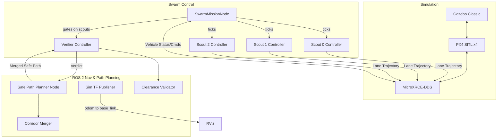

# GPS-Denied Autonomous Mine Detection Swarm

This workspace contains a ROS 2 + PX4 SITL (Software In The Loop) simulation for an autonomous drone swarm designed to map a minefield and guide a human safely out without using GPS.

## Overview

The mission uses a swarm of 4 drones operating in a 10x40m simulated minefield:
1. **Scout Drones (Drones 0, 1, 2):** Fly in parallel lanes to detect obstacles and simulated mines.
2. **Path Planner:** Central ROS node that merges the scouts' observations to calculate a safe human escape path with maximum clearance.
3. **Verifier Drone (Drone 3):** Takes off automatically after scouts finish, flies the generated human escape path, verifies physical clearance, and issues a final `SAFE` or `UNSAFE` verdict.
4. **Human Subject:** Escapes the Start Zone using the verified path.

## Architecture



## Running the Simulation

You will need **3 separate terminal windows** to run the complete sequence.

### Terminal 1: Launch Gazebo & PX4 Swarm
This script kills old processes, starts Gazebo, and spawns all 4 drones.
```bash
cd ~/px4_ros2_ws
bash start_swarm.sh
```
*Wait until the script prints:* `All 4 drones spawned!`

### Terminal 2: Launch ROS 2 Nodes & RViz
This starts the path planner and opens the RViz visualization.
```bash
cd ~/px4_ros2_ws
source install/setup.bash
ros2 launch robofest_sim robofest_sim.launch.py seed:=42 rviz:=true
```

### Terminal 3: Start the Autonomous Mission
This triggers the orchestrator node, which coordinates the scout drones and the verifier drone.
```bash
cd ~/px4_ros2_ws
source install/setup.bash
ros2 run px4_offboard swarm_mission_node
```

## Mission Sequence Details
1. **Scouting:** Drones 0, 1, and 2 take off simultaneously and fly three parallel lanes across the field. You will see their paths drawn in green, cyan, and yellow in RViz.
2. **Merging & Path Planning:** Once all 3 scouts land at the exit zone, the `safe_path_planner` processes the lanes, inflates obstacle zones, and publishes a thick white **Human Escape Path**. The red minefields and orange obstacle zones are revealed in RViz.
3. **Verification:** Drone 3 (the orange sphere in RViz) takes off from the back of the Start Zone and flies exactly along the white line. At each waypoint, it hovers to verify clearance from mines.
4. **Final Verdict:** Upon completing the path, Drone 3 flies to a clear landing zone (`Y=-4.0`) to avoid blocking the human, and publishes a final floating `SAFE` or `UNSAFE` text in RViz.

## Testing
The workspace contains 36 centralized unit and integration tests covering path planning, corridor merging, clearance validation, types, and node pipelines.

### Run Centralized ROS 2 Test Suite (Recommended):
```bash
cd ~/px4_ros2_ws
source install/setup.bash
colcon test --packages-select robofest_sim px4_offboard --event-handlers console_direct+
```

### Run Direct PyTest Suite:
```bash
cd ~/px4_ros2_ws
source install/setup.bash
python3 -m pytest src/robofest_sim/test/ src/px4_offboard/test/
```
