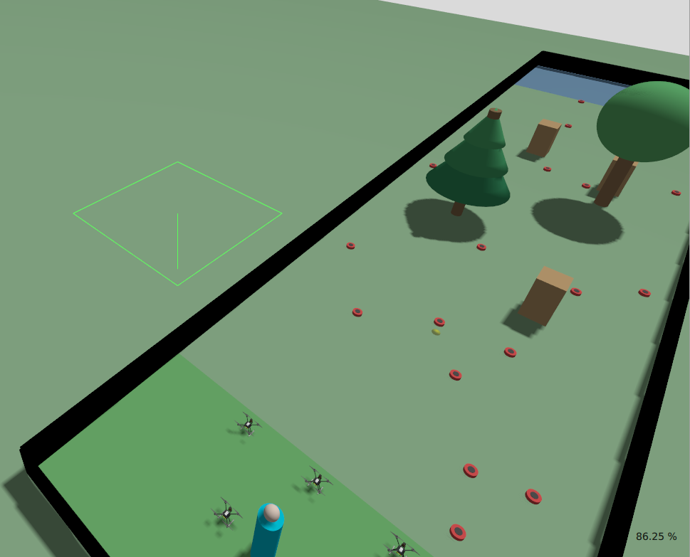
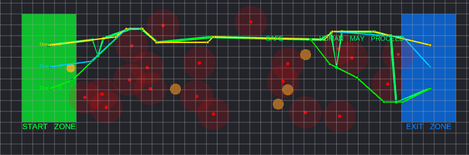
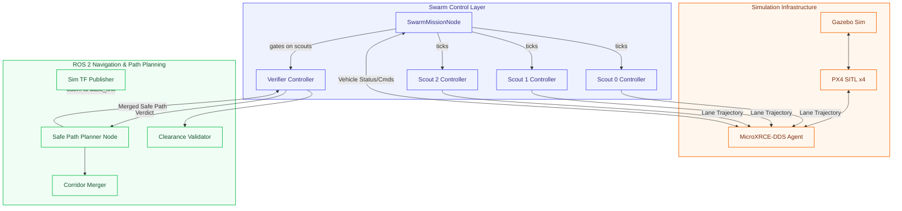
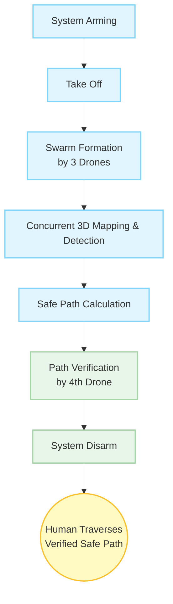
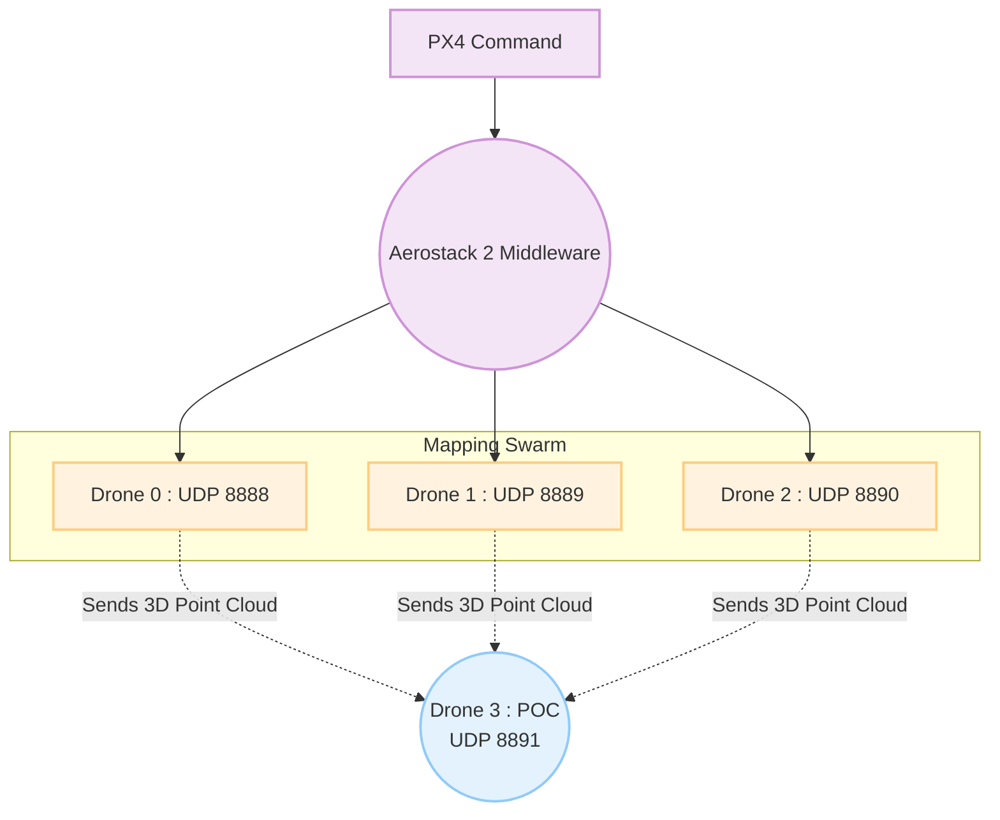
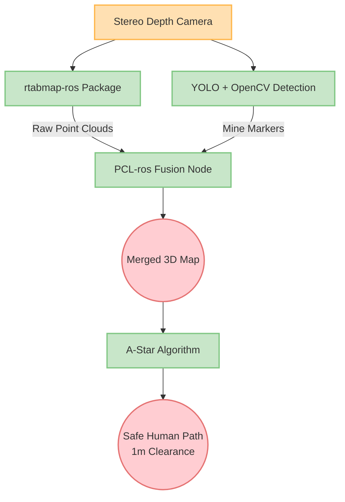

# GPS-Denied Autonomous Mine Detection Swarm

[](https://docs.ros.org/en/humble/)
[](https://px4.io/)
[](https://www.python.org/)
[](https://gazebosim.org/)
[](https://ubuntu.com/)

This workspace contains a ROS 2 + PX4 SITL (Software In The Loop) simulation for an autonomous drone swarm designed to map a minefield and guide a human safely out without using GPS.

## Overview

The mission uses a swarm of 4 drones operating in a 10x40m simulated minefield:
1. **Scout Drones (Drones 0, 1, 2):** Fly in parallel lanes to detect obstacles and simulated mines.
2. **Path Planner:** Central ROS node that merges the scouts' observations to calculate a safe human escape path with maximum clearance.
3. **Verifier Drone (Drone 3):** Takes off automatically after scouts finish, flies the generated human escape path, verifies physical clearance, and issues a final `SAFE` or `UNSAFE` verdict.
4. **Human Subject:** Escapes the Start Zone using the verified path.

### 🛠️ Tech Stack & Core Software Versions

| Component | Framework / Technology | Version | Key Functionality |
| :--- | :--- | :--- | :--- |
| **Robotics Middleware** | **ROS 2** | `Humble` | Pub/Sub topic transport, Action Servers, parameters & TF2 transforms |
| **Flight Autopilot** | **PX4 Autopilot** | `v1.14` | Physics SITL flight control, offboard position/velocity, EKF2 fusion |
| **Programming Language** | **Python** | `3.8+` | Mission orchestrator, A* path merger, clearance validator, ROS 2 nodes |
| **Physics Simulation** | **Gazebo Sim** | `Garden / Harmonic` | 3D multi-drone world simulation & sensor plugin dynamics |
| **Perception Sensors** | **Stereo Depth Camera + IMU** | `RealSense D435i` | Visual-Depth SLAM, 3D PointCloud, optical flow & altitude rangefinder |
| **DDS Middleware** | **MicroXRCE-DDS** | `v2.4+` | Ultra low-latency uORB to ROS 2 topic bridge |

### Simulation & Visualization Highlights

| PX4 SITL & Gazebo Swarm Lineup | RViz 2D Path Planning & Clearance Verdict |
| :---: | :---: |
|  |  |
| *4 PX4 SITL quadrotors lined up at Start Zone in Gazebo* | *Merged human escape corridor with clearance verification in RViz* |

## Architecture



---

## Package & Library Architecture Breakdown

This section details the software stack, perception components, and data pipelines powering the 4-drone autonomous swarm.

### 1. Core Drone Control & Middleware
* **Aerostack2 (AS2)**: Comprehensive ROS 2 framework designed for multi-robot aerial systems, acting as swarm middleware for modular mission control and concurrent drone behaviors.
* **PX4 Autopilot**: Flight control stack running on each drone, handling low-level hardware stabilization, arming, and motor commands.
* **Micro XRCE-DDS**: Critical agent bridge between PX4 uORB and ROS 2 over UDP (ports 8888–8891) for fast telemetry and offboard setpoint integration.
* **rclpy**: Standard Python client library for ROS 2 used heavily by the Single Point of Contact (Drone 3 / POC) to subscribe to point clouds and process safety coordinates.

### 2. Vision & 3D Mapping Pipeline
* **rtabmap-ros**: Graph-based Visual-Depth SLAM taking stereo depth feeds to incrementally build 3D point cloud maps.
* **YOLO & OpenCV**: Real-time object detection processing camera frames to identify landmine visual signatures and anchor precise 3D coordinates onto the map.
* **PCL-ros (Point Cloud Library)**: ROS 2 bridge for 3D geometry processing. Drone 3 (POC) uses PCL to filter, stitch, and merge point clouds from Drones 0, 1, and 2 into a master map.

### 3. Pathfinding & Simulation Environment
* **A* Algorithm**: Lowest-cost path search evaluating $f(n) = g(n) + h(n)$ over the unified 3D map to carve out a trajectory maintaining a strict 1-meter safety radius around mines.
* **Gazebo & RViz**: Gazebo provides physics-based frontend simulation for drone dynamics; RViz serves as backend visualizer for point clouds, mine markers, and calculated paths.

---

### Swarm Flow Diagrams

#### A. Mission Execution Workflow


#### B. Swarm Telemetry & Single Point of Contact (POC) Topology


#### C. Perception, Fusion & Pathfinding Pipeline


## Running the Simulation

You will need **3 separate terminal windows** to run the complete sequence.

### Terminal 1: Launch Gazebo & PX4 Swarm
This script kills old processes, starts Gazebo, and spawns all 4 drones.
```bash
cd ~/px4_ros2_ws
bash start_swarm.sh
```
*Wait until the script prints:* `All 4 drones spawned!`

### Terminal 2: Launch ROS 2 Nodes & RViz
This starts the path planner and opens the RViz visualization.
```bash
cd ~/px4_ros2_ws
source install/setup.bash
ros2 launch robofest_sim robofest_sim.launch.py seed:=42 rviz:=true
```

### Terminal 3: Start the Autonomous Mission
This triggers the orchestrator node, which coordinates the scout drones and the verifier drone.
```bash
cd ~/px4_ros2_ws
source install/setup.bash
ros2 run px4_offboard swarm_mission_node
```

## Mission Sequence Details
1. **Scouting:** Drones 0, 1, and 2 take off simultaneously and fly three parallel lanes across the field. You will see their paths drawn in green, cyan, and yellow in RViz.
2. **Merging & Path Planning:** Once all 3 scouts land at the exit zone, the `safe_path_planner` processes the lanes, inflates obstacle zones, and publishes a thick white **Human Escape Path**. The red minefields and orange obstacle zones are revealed in RViz.
3. **Verification:** Drone 3 (the orange sphere in RViz) takes off from the back of the Start Zone and flies exactly along the white line. At each waypoint, it hovers to verify clearance from mines.
4. **Final Verdict:** Upon completing the path, Drone 3 flies to a clear landing zone (`Y=-4.0`) to avoid blocking the human, and publishes a final floating `SAFE` or `UNSAFE` text in RViz.

## Testing
The workspace contains 36 centralized unit and integration tests covering path planning, corridor merging, clearance validation, types, and node pipelines.

### Run Centralized ROS 2 Test Suite (Recommended):
```bash
cd ~/px4_ros2_ws
source install/setup.bash
colcon test --packages-select robofest_sim px4_offboard --event-handlers console_direct+
```

### Run Direct PyTest Suite:
```bash
cd ~/px4_ros2_ws
source install/setup.bash
python3 -m pytest src/robofest_sim/test/ src/px4_offboard/test/
```

---

## Project Documentation Index

For detailed architectural, theoretical, and simulation documentation, refer to the dedicated guides:

* **[SIMULATION.md](SIMULATION.md)** — Complete simulation showcase including embedded recording ([Watch on Google Drive](https://drive.google.com/file/d/1PemHGHgeK6kQS8JV9aWgJ4_nk7bf7xsx/view?usp=drive_link)) and step-by-step image analysis across all 5 flight phases (Pre-Flight Setup, Scout Scanning, Landing, Verification, RViz Verdict).
* **[slam_architecture.md](slam_architecture.md)** — In-depth Visual-Depth SLAM pipeline (Stereo Depth Camera + IMU), PX4 EKF2 sensor fusion integration (Stereo Depth $X,Y$ + Rangefinder $Z$ + Optical Flow velocity), frame transforms, and hardware deployment options.
* **[aerostack2_swarm_architecture.md](aerostack2_swarm_architecture.md)** — Comprehensive Aerostack2 (AS2) framework architecture blueprint, 5-layer system diagrams, Behavior Tree swarm control flow (`py_trees`), package mapping, and hardware deployment roadmap.

---

## Reference Repositories & Frameworks Used

This project references and integrates components from the following open-source aerial robotics frameworks and repositories:

* **[Aerostack2 (`aerostack2/aerostack2`)](https://github.com/aerostack2/aerostack2)**: Referenced for multi-drone ROS 2 behavior-based control, Hardware Abstraction Layer (HAL) concepts, and hardware deployment roadmap (see [`aerostack2_swarm_architecture.md`](aerostack2_swarm_architecture.md)).
* **[PX4 Autopilot (`PX4/PX4-Autopilot`)](https://github.com/PX4/PX4-Autopilot)**: Open-source flight stack providing multi-instance PX4 SITL physics simulation, offboard mode, and EKF2 sensor fusion.
* **[Micro-XRCE-DDS Agent (`eProsima/Micro-XRCE-DDS-Agent`)](https://github.com/eProsima/Micro-XRCE-DDS-Agent)**: Client-agent middleware connecting PX4 uORB topics directly into ROS 2 nodes over high-speed UDP/Serial transport.
* **[RTAB-Map / Visual-Depth SLAM (`introlab/rtabmap`)](https://github.com/introlab/rtabmap)**: Stereo Depth Camera & VIO pose-graph optimization framework used for 3D mapping and GPS-denied localization.
* **[ROS-Gazebo Bridge (`gazebosim/ros_gz`)](https://github.com/gazebosim/ros_gz)**: ROS 2 to Gazebo Ignition / Harmonic transport bridge for Stereo Depth camera topics (`/camera/depth`, `/camera/points`), IMU, clock synchronization, and odometry feedback.

