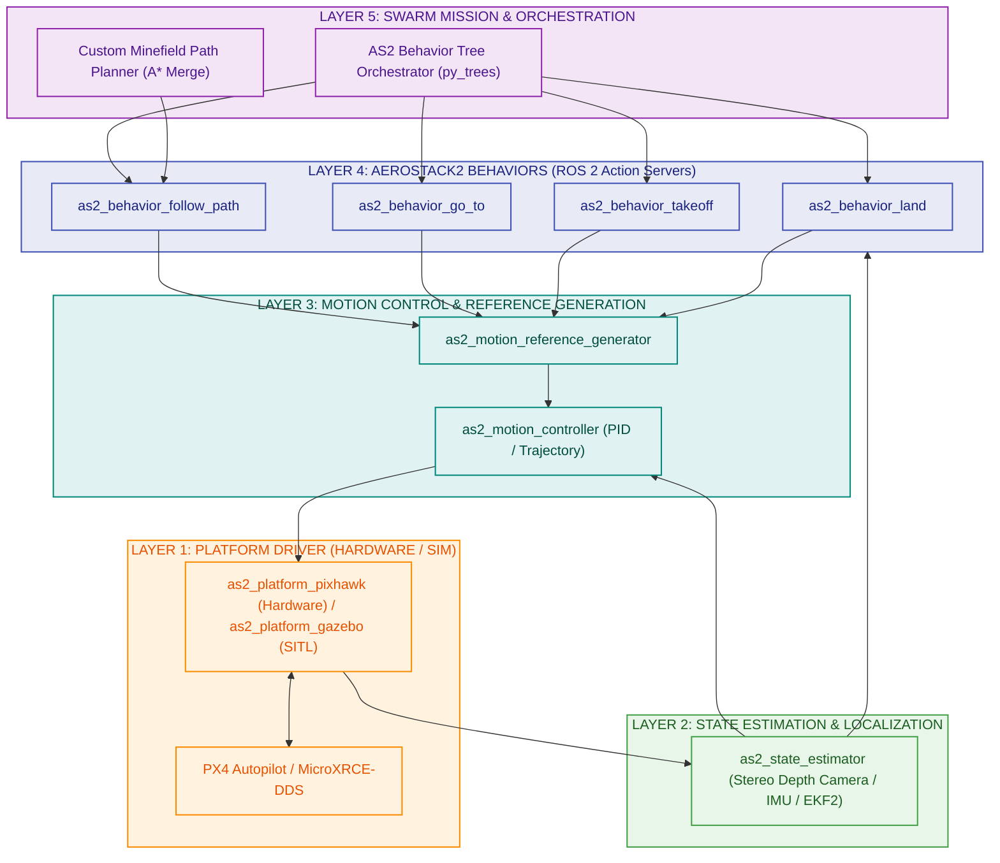
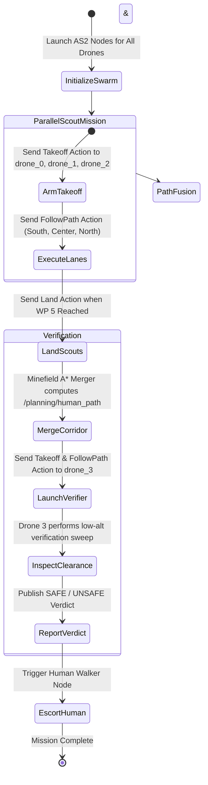

# Aerostack2 (AS2) Multi-Drone Swarm Architecture Blueprint

---

## 1. Theoretical Foundations & Aerostack2 Architectural Framework

### A. Paradigm Shift: Service-Oriented & Component-Based Multi-Robot Systems (MRS)
Classical aerial robotics software typically couples flight control logic, sensor processing, and high-level mission state machines into monolithic scripts. As drone swarms scale (e.g., from 1 to $N$ agents), this monolithic pattern creates exponential complexity, tight dependencies, and fragility.

**Aerostack2 (AS2)** solves this by enforcing a **Service-Oriented Architecture (SOA)** built on ROS 2. It decomposes autonomous aerial systems into five decoupled, specialized layers. Each drone operates as an independent agent isolated within its own ROS 2 namespace (`/drone_0`, `/drone_1`, etc.), communicating through standardized **ROS 2 Action Servers, Services, and Topics**.

### B. Core Theoretical Pillars of Aerostack2

1. **Hardware Abstraction Layer (HAL)**:
   - Hides platform-specific implementation details (PX4 Autopilot uORB topics, MAVLink, Crazyflie CRTP, or Gazebo Ignition APIs) behind unified platform drivers (`as2_platform`).
   - High-level behavior algorithms write commands to abstract state representations regardless of whether the physical hardware is a Pixhawk FMUv5, NXP B3RB, or SITL simulator.

2. **Behavior-Based Control & ROS 2 Action Interfaces**:
   - Complex flight tasks are modeled as **Behaviors** (e.g., `Takeoff`, `Land`, `GoTo`, `FollowPath`).
   - Behaviors act as ROS 2 Action Servers providing:
     - **Goal Acceptance/Rejection**: Safety validation before execution.
     - **Non-Blocking Feedback**: Real-time progress updates to mission supervisors (e.g., remaining distance, speed).
     - **Preemption & Cancellation**: Emergency abort capabilities at any millisecond.

3. **Behavior Trees (BT) vs. Finite State Machines (FSM)**:
   - While traditional systems use rigid FSMs, Aerostack2 leverages **Behavior Trees (`py_trees`)** for swarm orchestration.
   - BTs provide reactive control, modular subtree reuse, fallback recovery branches, and concurrent execution nodes—allowing 3 scout drones to execute parallel scanning behaviors seamlessly while handling individual agent failures gracefully.

4. **Modular Plug-and-Play State Estimation**:
   - The localization pipeline decouples estimation algorithms from flight controllers.
   - State estimation plugins (e.g., `Stereo Depth Camera Visual SLAM`, `Visual-Inertial Odometry (VIO)`, `GPS`, or `Mocap`) output standardized `nav_msgs/Odometry` in the global `earth` frame.

---

## 2. System Overview & Aerostack2 Layered Architecture

Aerostack2 uses a **modular, 5-layer ROS 2 architecture**. Each drone runs standard AS2 nodes connected via **ROS 2 Actions, Services, and Topics**:

---

## 3. Namespace & Drone Role Allocation

In Aerostack2, each drone runs an identical set of stack nodes isolated by namespace:

| Drone Namespace | Mission Role | AS2 Platform | Key Active Behaviors |
| :--- | :--- | :--- | :--- |
| `/drone_0` | **Scout South** ($Y=-2.0$) | `as2_platform_pixhawk` | `Takeoff`, `FollowPath` (South Lane), `Land` |
| `/drone_1` | **Scout Center** ($Y=0.0$) | `as2_platform_pixhawk` | `Takeoff`, `FollowPath` (Center Lane), `Land` |
| `/drone_2` | **Scout North** ($Y=+2.0$) | `as2_platform_pixhawk` | `Takeoff`, `FollowPath` (North Lane), `Land` |
| `/drone_3` | **Verifier Drone** ($Y=1.0$) | `as2_platform_pixhawk` | `Takeoff`, `FollowPath` (Human Corridor), `Land` |

---

## 4. Behavior Tree Swarm Control Flow (`as2_behavior_tree`)

Aerostack2 orchestrates the multi-drone mission using **Behavior Trees** (`py_trees`):

---

## 5. Aerostack2 Package Mapping Table

Here is how your current codebase maps directly to Aerostack2 official packages:

| Functionality | Your Current Code (`robofest_sim`) | Aerostack2 Equivalent Package |
| :--- | :--- | :--- |
| **PX4 Interface** | Custom `px4_msgs` MicroXRCE bridge | `as2_platform_pixhawk` / `as2_platform_gazebo` |
| **State Estimation** | `px4_ext_odom_node` + Visual-Depth SLAM | `as2_state_estimator` (Plugin: Stereo Depth Camera / EKF) |
| **Motion Reference** | Custom setpoint publisher | `as2_motion_reference_generator` |
| **Drone Controller**| `swarm_mission_node.py` | `as2_behavior_tree` + AS2 Behaviors (`as2_behavior_follow_path`) |
| **Path Merger** | `safe_path_planner.py` | Custom AS2 Mission Plugin / ROS 2 Action Server |
| **Verifier Escort** | `verifier_drone_controller.py` | `drone_3/as2_behavior_follow_path` |

---

## 6. Aerostack2 ROS 2 Topic & Action Interface Standard

When using Aerostack2, communication uses standard AS2 action definitions:

### A. Takeoff Action
* **Action**: `as2_msgs/action/Takeoff`
* **Goal Topic**: `/drone_N/behavior_takeoff/_action/send_goal`
* **Parameters**: `height: 1.2`, `speed: 0.5`

### B. Follow Path Action
* **Action**: `as2_msgs/action/FollowPath`
* **Goal Topic**: `/drone_N/behavior_follow_path/_action/send_goal`
* **Parameters**: `header.frame_id: "earth"`, `path: nav_msgs/Path`, `speed: 0.8`

### C. Land Action
* **Action**: `as2_msgs/action/Land`
* **Goal Topic**: `/drone_N/behavior_land/_action/send_goal`
* **Parameters**: `speed: 0.4`

---

## 7. Implementation Roadmap for Aerostack2

1. **Step 1: Install AS2 Core**: Install Aerostack2 via ROS 2 Humble binary/source (`ros-humble-aerostack2`).
2. **Step 2: Platform Driver Setup**: Configure `as2_platform_pixhawk` for each drone instance.
3. **Step 3: Behavior Nodes Setup**: Launch `as2_behavior_takeoff`, `as2_behavior_land`, and `as2_behavior_follow_path` in each drone's namespace.
4. **Step 4: Custom Path Planner Action**: Expose `safe_path_planner.py` as an AS2-compliant ROS 2 Action Server publishing `nav_msgs/Path`.
5. **Step 5: Behavior Tree Launch**: Write `swarm_mission.xml` / Python Behavior Tree script to trigger the 3 scouts in parallel, followed by the verifier drone.
