# Autonomous Swarm Minefield Detection & Human Escort Simulation

Welcome to the full simulation showcase of the **GPS-Denied Swarm Minefield Detection, Path Planning, Verification, and Human Escort** system.

---

## Full Simulation Recording

  <video id="mainSimVideo" width="100%" controls autoplay loop muted style="border-radius: 8px; box-shadow: 0 4px 12px rgba(0,0,0,0.3);">
    <source src="main.mp4" type="video/mp4">
    Your browser does not support the video tag.
  </video>
  
  
<em>Note: Video is set to play automatically at 2.0x playback speed.</em>

---

## Simulation Phase Breakdown & Image Analysis

### Pre-Flight & Mission Setup

#### Initial Swarm Lineup & Ground Truth Overview

* **Where & Perspective**: Gazebo 3D perspective view facing the green Start Zone ($X: 0\text{m} \to 5\text{m}$).
* **How & What**: All 4 quadrotors (Drones 0, 1, 2 Scouts + Drone 3 Verifier) line up behind the cyan human cylinder model while minefield obstacles, trees, and simulated mines spawn ahead.

---

### Simultaneous 3-Lane Scout Mission

#### Scout Swarm Simultaneous Arm & Takeoff
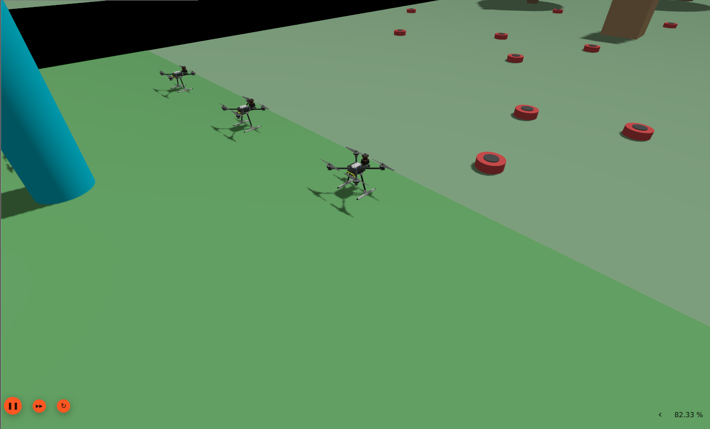
* **Where & Perspective**: Gazebo 3D close-up perspective of the Start Zone launch pad.
* **How & What**: Drones 0, 1, and 2 transition from `ARM` $\to$ `TAKEOFF` simultaneously, ascending to a target cruise altitude of $1.2\text{m}$ in Offboard mode.

#### Parallel 3-Lane Minefield Scanning
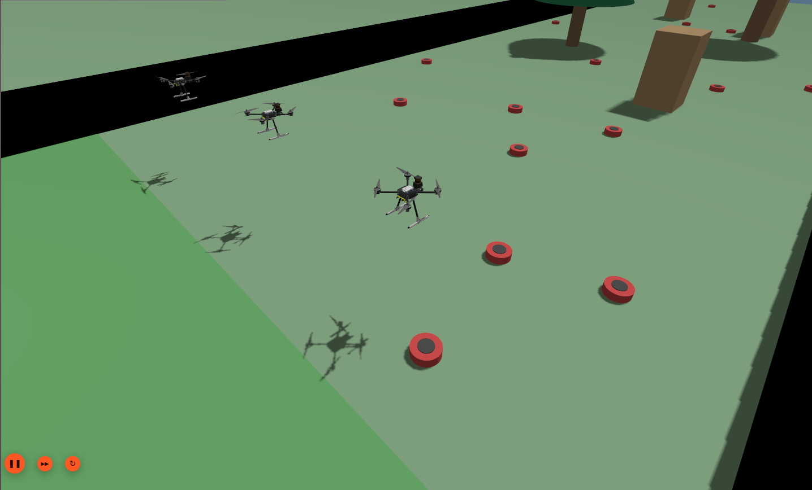
* **Where & Perspective**: Gazebo 3D aerial view tracking the drones entering the minefield boundary ($X = 5\text{m}$).
* **How & What**: Scout drones execute concurrent 2D LiDAR scanning across South ($Y=-2$), Center ($Y=0$), and North ($Y=+2$) lanes to detect mine positions in real-time.

#### Precision Obstacle Avoidance (Drone 0 South)
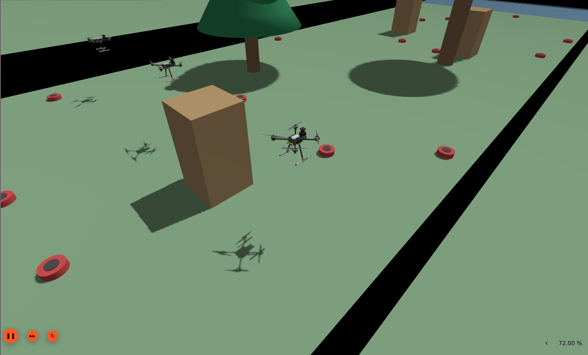
* **Where & Perspective**: Gazebo 3D close-up view of the South lane ($Y=-2.0\text{m}$).
* **How & What**: Drone 0 adjusts yaw and lateral position to clear a tall rectangular block while maintaining its active LiDAR scan match.

#### Mid-Field Formation Scan
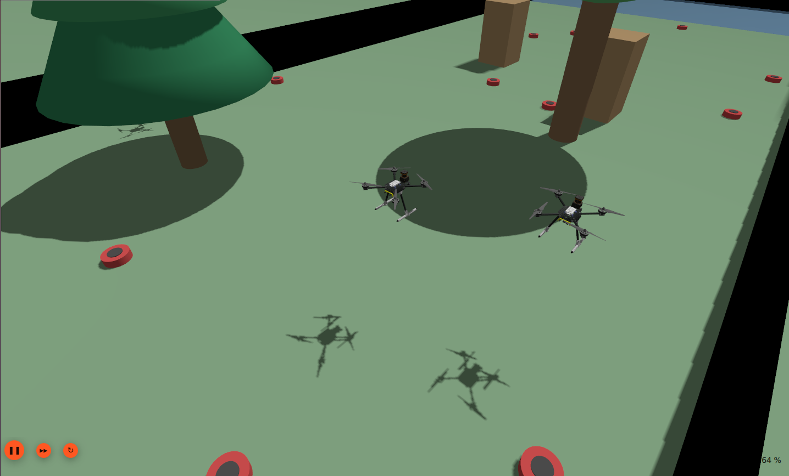
* **Where & Perspective**: Gazebo 3D perspective tracking Drones 0 and 1 near the field center ($X = 20\text{m}$).
* **How & What**: Scouts maintain uniform spacing and altitude control to ensure complete sensor coverage of the minefield gap.

#### Complex Environmental Navigation
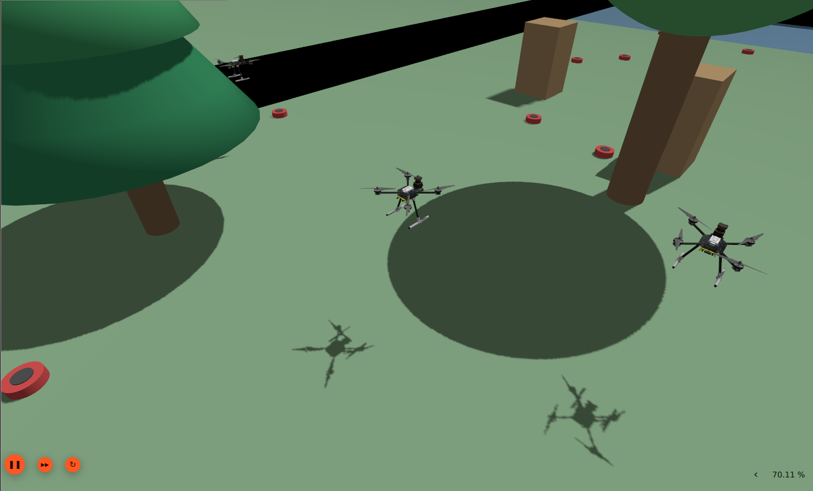
* **Where & Perspective**: Gazebo 3D perspective under tree foliage canopy.
* **How & What**: Drones navigate tight corridors between round trees and wooden blocks without losing EKF2 optical flow tracking.

#### Near-Obstacle Clearance Flight
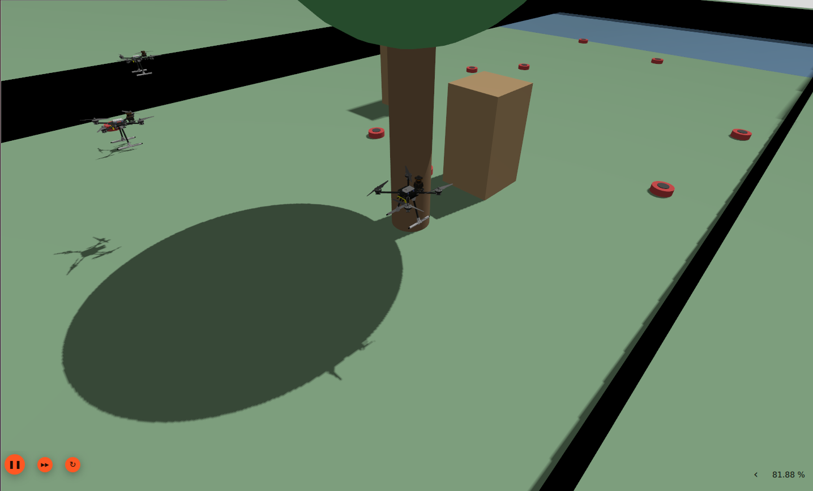
* **Where & Perspective**: Gazebo 3D low-angle view near a central tree trunk.
* **How & What**: Scout 0 executes tight obstacle clearance, validating real-time rangefinder height readings and 2D scan matching.

#### Approach to Exit Zone
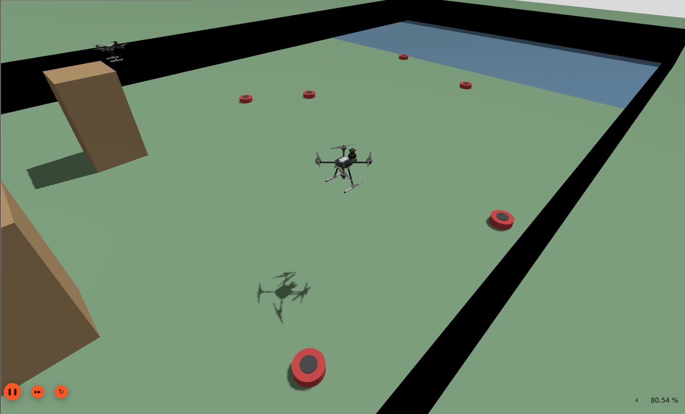
* **Where & Perspective**: Gazebo 3D perspective looking toward the blue Exit Zone pad ($X = 35\text{m}$).
* **How & What**: Scout 1 reaches final waypoint 5/5 and initiates transition to `HOLD_END` state over the clear landing pad.

---

### Scout Landing & Path Fusion

#### Synchronized Scout Descent
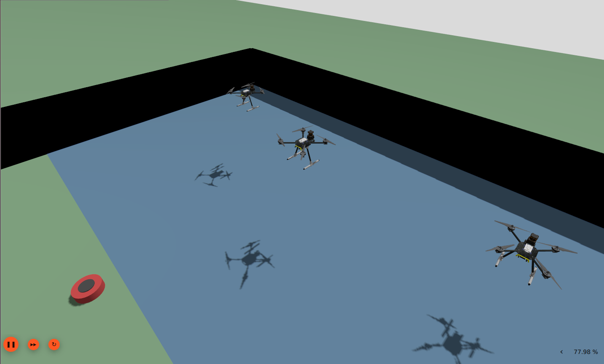
* **Where & Perspective**: Gazebo 3D high-angle perspective of the Exit Zone landing area.
* **How & What**: Drones 0, 1, and 2 enter `LAND` state, descending at $0.4\text{m/s}$ to complete their scanning mission.

#### Touchdown & Scouts Done Signal
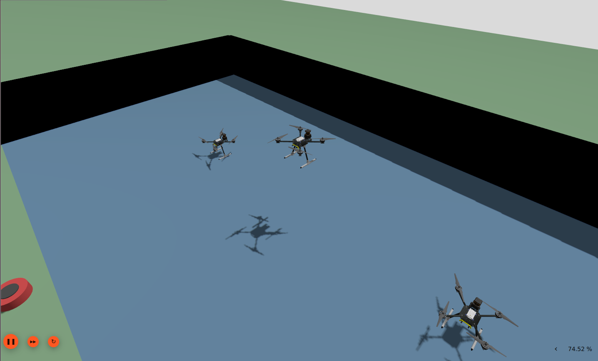
* **Where & Perspective**: Gazebo 3D view of scout drone landing feet making contact with the landing pad.
* **How & What**: Scouts reach `DONE` state, triggering the `/mission/scouts_done` ROS 2 signal to activate the A* path fusion engine.

---

### Path Verification & Escort Mission

#### Verifier Drone 3 Autonomous Launch
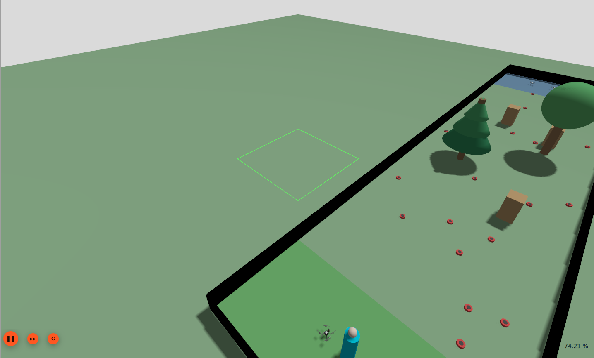
* **Where & Perspective**: Gazebo 3D view of the green Start Zone launch area.
* **How & What**: Drone 3 receives the merged human escape path, arms, and takes off to begin verification.

#### Verifier Pre-Inspection Hover
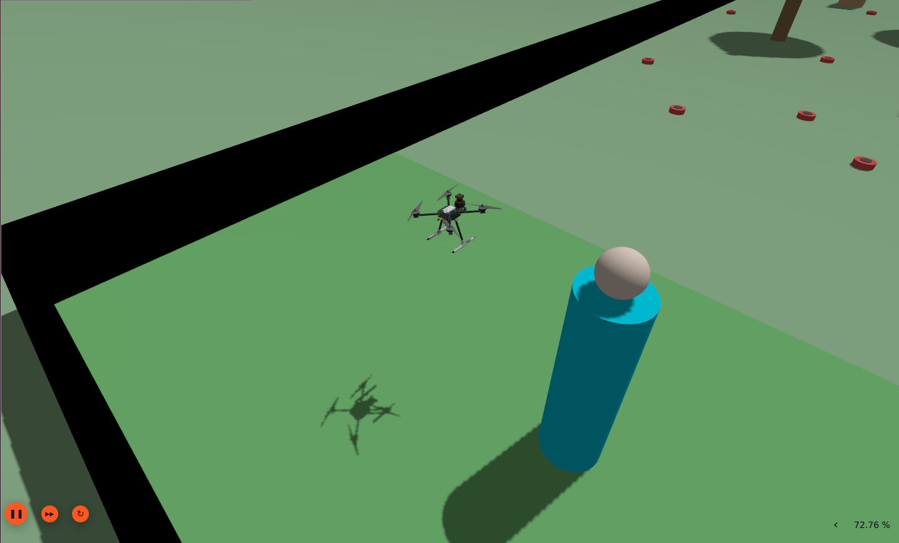
* **Where & Perspective**: Gazebo 3D perspective beside the human cylinder model.
* **How & What**: Drone 3 holds at cruise altitude next to the human model before embarking on the low-altitude inspection sweep.
* **Where & Perspective**: Gazebo 3D overview of the blue Exit Zone.
* **How & What**: Confirms Drones 0, 1, and 2 are fully disarmed and stationary in the landing zone.

#### Verifier Touchdown & Mission Completion
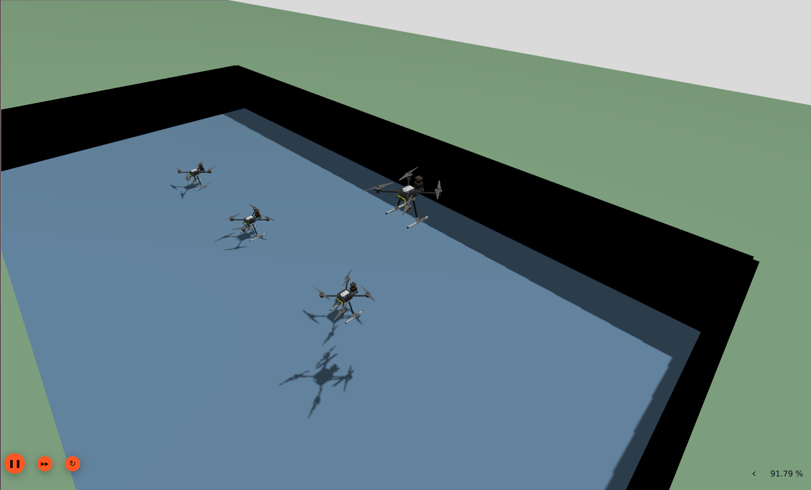
* **Where & Perspective**: Gazebo 3D view of the Exit Zone pad.
* **How & What**: Drone 3 completes its verification sweep along the human path and lands safely beside the scout fleet.
* **Where & Perspective**: Gazebo 3D wide perspective of the completed flight operations.
* **How & What**: All 4 quadrotors safely parked in the Exit Zone after completing scouting and path verification.

---

### Path Verification & Human Escort Output (RViz)

#### Merged Human Escape Corridor & Clearance Verdict
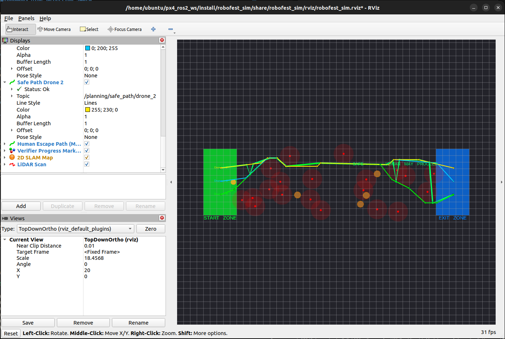
* **Where & Perspective**: RViz 2D Top-Down Ortho view with active display overlays.
* **How & What**: Displays the merged human path in bright yellow/cyan with green waypoint markers and the verdict banner: `SAFE - HUMAN MAY PROCEED`.
* **Where & Perspective**: RViz 2D Top-Down full spatial layout view.
* **How & What**: Shows the $1.5\text{m}$ red mine clearance bubbles surrounding every detected mine, proving zero intersection with the human path.

#### Final Human Path & Escort Corridor

* **Where & Perspective**: RViz 2D Top-Down high-resolution cropped visualization.
* **How & What**: Illustrates the final verified human corridor (bright green line) connecting Start Zone to Exit Zone with yellow human marker walking safely to the goal.
