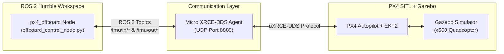

param set NAV_DLL_ACT 0

# PX4 ROS 2 Offboard Control & System Guide (Phase 1.5)

## 1. Overview

This document provides a comprehensive guide for the **ROS 2 Humble + PX4 SITL Offboard Control System** built in `px4_ros2_ws`. It covers system architecture, node implementation details, state machine logic, PX4 parameter configuration, and PX4 shell (`pxh>`) commands.

---

## 2. High-Level System Architecture



### Components
1. **PX4 SITL + Gazebo (`px4_sitl gz_x500`)**: Simulates quadcopter dynamics, motors, sensors (IMU, mag, baro, GPS), and low-level PX4 EKF2 state estimator.
2. **Micro XRCE-DDS Agent (`MicroXRCEAgent udp4 -p 8888`)**: High-performance bridge converting lightweight PX4 `uORB` binary messages into standard ROS 2 `/fmu/*` topics.
3. **ROS 2 Offboard Node (`px4_offboard`)**: High-level control node streaming heartbeat signals, trajectory setpoints, and vehicle commands.

---

## 3. ROS 2 Package Structure (`px4_offboard`)

```text
px4_ros2_ws/src/px4_offboard/
├── package.xml                           # ROS 2 package manifest (ament_python)
├── setup.py                              # Package build script & entry points
├── setup.cfg                             # Installation directory paths
├── resource/
│   └── px4_offboard                      # Ament package index marker
└── px4_offboard/
    ├── __init__.py                       # Python module initialization
    └── offboard_control_node.py          # Main offboard control node
```

---

## 4. Offboard Control Logic & State Machine

### A. Topic Interfaces
- **Published Topics**:
  - `/fmu/in/offboard_control_mode` (`px4_msgs/msg/OffboardControlMode`): Indicates position control active.
  - `/fmu/in/trajectory_setpoint` (`px4_msgs/msg/TrajectorySetpoint`): Target NED coordinates $[x, y, z]$.
  - `/fmu/in/vehicle_command` (`px4_msgs/msg/VehicleCommand`): MAVLink vehicle commands.
- **Subscribed Topics**:
  - `/fmu/out/vehicle_status_v4` (`px4_msgs/msg/VehicleStatus`): Vehicle status (`nav_state`, `arming_state`).
  - `/fmu/out/vehicle_command_ack_v1` (`px4_msgs/msg/VehicleCommandAck`): Command execution results.

### B. Coordinate Frame (NED)
PX4 uses **North-East-Down (NED)** coordinates:
- $x = 0.0\text{ m}$ (North)
- $y = 0.0\text{ m}$ (East)
- $z = -2.0\text{ m}$ (Down is negative $\rightarrow$ **2 meters above takeoff location**)

### C. State Machine Sequence

```mermaid
stateDiagram-v8
    [*] --> WarmUp: Stream setpoints @ 10Hz (1s)
    WarmUp --> RequestOffboard: Warm-up complete
    RequestOffboard --> RequestArm: nav_state == 14 (Offboard Active)
    RequestArm --> Hover: arming_state == 2 (Armed)
    Hover --> Land: 10 seconds hover complete
    Land --> [*]: Touchdown
```

1. **Continuous Setpoint Streaming (10 Hz)**: Streams `OffboardControlMode` and `TrajectorySetpoint` continuously to avoid PX4 offboard loss failsafe (> 2 Hz required).
2. **Mode Switch**: Sends `VEHICLE_CMD_DO_SET_MODE` (176) to enter Offboard mode (`nav_state = 14`).
3. **Motor Arming**: Sends `VEHICLE_CMD_COMPONENT_ARM_DISARM` (400) to arm motors (`arming_state = 2`).
4. **Hover Phase**: Maintains altitude setpoint ($z = -2.0\text{m}$) for 10 seconds.
5. **Auto Land**: Sends `VEHICLE_CMD_NAV_LAND` (21) for smooth autonomous touchdown.

---

## 5. PX4 Safety Configuration (`NAV_DLL_ACT`)

By default, PX4 enforces a Data Link Loss check requiring a Ground Control Station (GCS). When running pure ROS 2 offboard control without QGroundControl, PX4 triggers:
```text
WARN [health_and_arming_checks] Preflight Fail: No connection to the GCS
```

### Fix
In the PX4 SITL shell prompt (`pxh>`), set:
```bash
pxh> param set NAV_DLL_ACT 0
```
This disables the GCS connection check for offboard SITL tests.

---

## 6. PX4 Console (`pxh>`) Command Reference

| Command Category | Command | Description |
| :--- | :--- | :--- |
| **Flight Control** | `commander arm` | Arms the drone motors manually. |
| | `commander disarm` | Disarms the motors immediately. |
| | `commander takeoff` | Arms and takes off to default altitude (~2.5m). |
| | `commander land` | Triggers autonomous landing. |
| | `commander mode offboard` | Switches flight mode to Offboard. |
| | `commander status` | Prints vehicle health, nav state, and active failsafes. |
| | `commander check` | Runs preflight arming checks and reports failures. |
| **Parameters** | `param show NAV_*` | Displays parameters matching pattern. |
| | `param get NAV_DLL_ACT` | Gets value of specific parameter. |
| | `param set NAV_DLL_ACT 0` | Updates parameter live in memory. |
| | `param save` | Saves parameter changes to storage (`parameters.bson`). |
| **Topic Listening** | `listener vehicle_status` | Prints live `VehicleStatus` uORB topic data. |
| | `listener vehicle_local_position` | Prints estimated 3D position and velocity. |
| | `listener trajectory_setpoint` | Prints target setpoint received from ROS 2. |
| **Bridge Info** | `uxrce_dds_client status` | Displays DDS bridge connection details & time sync. |
| **System Debug** | `top` | Live CPU, stack, and memory monitor for PX4 threads. |
| | `dmesg` | Prints system log messages. |
| | `ver all` | Shows firmware version and hardware build details. |

---

## 7. How to Run the Complete Pipeline

### Terminal 1: Micro XRCE-DDS Agent
```bash
cd ~/px4_ros2_ws
MicroXRCEAgent udp4 -p 8888
```

### Terminal 2: PX4 SITL + Gazebo
```bash
cd ~/PX4-Autopilot
make px4_sitl gz_x500
```
*(After boot, type `param set NAV_DLL_ACT 0` in the `pxh>` prompt if running without QGroundControl)*

### Terminal 3: ROS 2 Offboard Control Node
```bash
cd ~/px4_ros2_ws
source /opt/ros/humble/setup.bash
source install/setup.bash
ros2 run px4_offboard offboard_control
```
