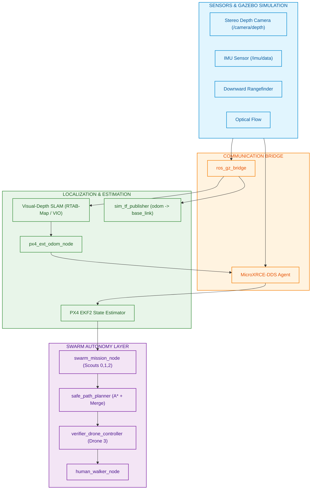

# 🛸 Swarm Visual-Depth SLAM & Autonomous System Architecture

This document provides a comprehensive overview of the **System Architecture**, **Stereo Depth Camera + IMU SLAM Pipeline**, **Swarm Control Flow**, and the **Hardware Deployment Roadmap** (including Aerostack2 integration choices).

---

## 1. Executive Summary & Flow Diagram

The system operates in a **GPS-Denied Environment** using a **Stereo Depth Camera (Intel RealSense D435i) + IMU Visual-Depth SLAM** combined with **PX4 EKF2 Sensor Fusion** (Optical Flow + Downward Rangefinder) for multi-drone autonomous minefield mapping, path planning, verification, and human escort.

---

## 2. Current Simulation Architecture Breakdown

### A. Localization & Mapping Pipeline (Visual-Depth SLAM)
* **Sensor Suite**: Intel RealSense D435i Stereo Depth Camera + High-Rate IMU.
* **Algorithm**: Visual-Depth SLAM & PointCloud Obstacle Mapping.
* **Input**: Stereo Depth Streams (`/camera/depth/image_raw`), PointClouds (`/camera/depth/color/points`), and IMU (`/imu/data`).
* **Frame Hierarchy**:
  $$\text{map} \longrightarrow \text{odom} \longrightarrow \text{base\_link} \longrightarrow \text{camera\_link}$$

### B. PX4 Sensor Fusion (EKF2 Integration)
To achieve ultra-stable 3D flight in GPS-denied environments:
1. **$X, Y$ Position & Yaw**: Derived from Stereo Depth Camera Visual SLAM pose via `px4_ext_odom_node` fed into `VehicleOdometry` uORB topic.
2. **6-DOF Motion Rates**: Measured continuously by high-frequency onboard IMU.
3. **$Z$ Altitude**: Measured directly by Downward Rangefinder / Distance Sensor.
4. **Horizontal Velocity**: Estimated via Optical Flow sensor.

### C. Swarm Control & Mission Pipeline
* **Scouts (Drones 0, 1, 2)**: Sweep South ($Y=-2$), Center ($Y=0$), and North ($Y=+2$) lanes simultaneously.
* **Path Planner (`safe_path_planner`)**: Merges scout paths using A* grid search into a single **Human Escape Corridor** that maximizes clearance from detected mine positions.
* **Verifier Drone (Drone 3)**: Escorts along the escape corridor, performs low-altitude clearance checks at each waypoint, and publishes a `SAFE`/`UNSAFE` verdict report.
* **Human Escort (`human_walker_node`)**: Animates human model along the verified corridor once safety is confirmed.

---

## 3. Hardware Deployment Options: Current Stack vs. Aerostack2

When transitioning from **Gazebo Simulation** to **Real Physical Hardware** (e.g., NXP B3RB / Jetson Orin Nano + PX4 Autopilot + Intel RealSense D435i Stereo Depth Camera):

### Option A: Retain Native Custom ROS 2 Stack (Recommended for Initial Hardware Tests)
* **Pros**:
  * 100% code reusability from simulation to real drones.
  * Direct low-latency control via `px4_msgs` over MicroXRCE-DDS (Serial/UART bridge).
  * Lightweight footprint running directly on companion computers (Jetson Orin Nano / Raspberry Pi 4).
* **Cons**: Manual configuration of companion-to-PX4 serial parameters.

### Option B: Migrate to Aerostack2 (AS2) Framework
* **Pros**:
  * Standardization: Uses standard ROS 2 Actions (`Takeoff`, `Land`, `GoTo`, `FollowPath`).
  * Behavior Trees: Easily reconfigurable mission logic.
  * Multi-robot fleet management interface.
* **Cons**:
  * High migration effort (requires wrapping custom minefield path merger into AS2 plugin modules).
  * Higher memory and computational overhead on small companion boards.

---

## 4. Hardware Comparison Matrix

| Feature | Current Sim Stack (`robofest_sim`) | Hardware via Native ROS 2 | Hardware via Aerostack2 (AS2) |
| :--- | :--- | :--- | :--- |
| **Transport** | MicroXRCE-DDS (UDP / Sim) | MicroXRCE-DDS (UART/Serial) | AS2 Platform Driver for PX4 |
| **Primary Perception**| Stereo Depth Camera + IMU | Intel RealSense D435i | AS2 Depth Camera Plugin |
| **Localization** | Visual-Depth SLAM | RTAB-Map / VIO | AS2 SLAM / Localization Node |
| **Mission Logic** | Custom Python State Machine | Custom Python State Machine | AS2 Behavior Trees |
| **Migration Risk**| None (Baseline) | **Low** (Change UDP $\to$ TTY) | **High** (Refactor to AS2 Actions) |
